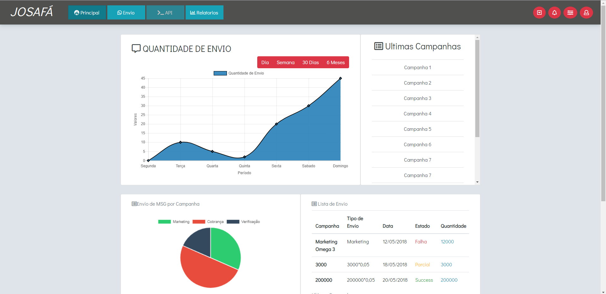
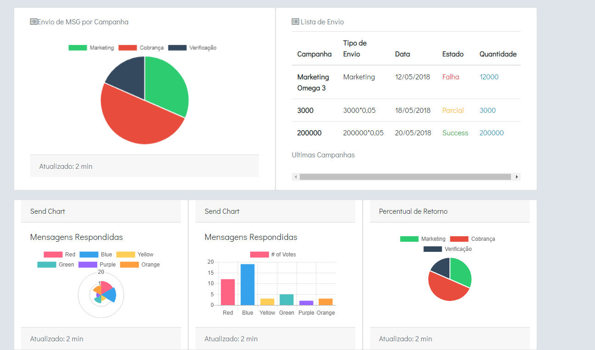
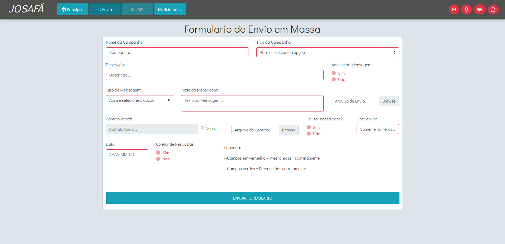
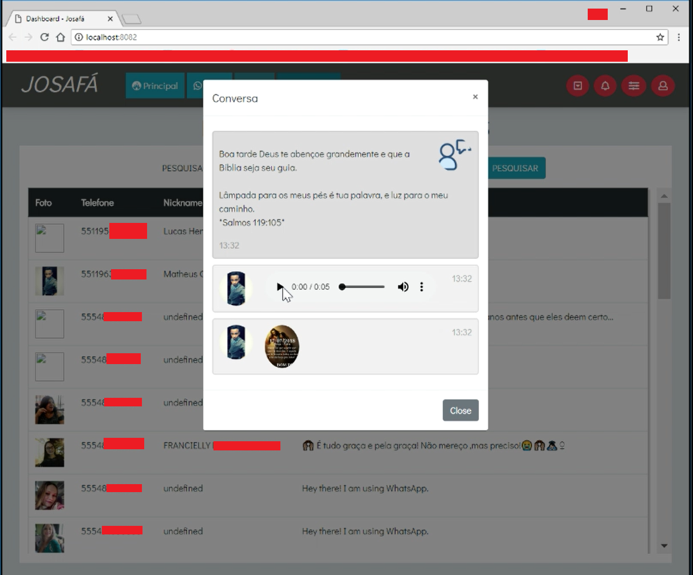

# WhatsApp Sending Dashboard Project

This is a project for study and improvement purposes that simulates a dashboard of whatsapp sending campaigns in a way similar to what happens with email and SMS in which the scripts were hidden in order not to be commercialized as marketing massive messages.

The first version was developed using HTML + CSS + JavaScript / JQuery for the front-end and will be migrated to Angular 4 soon. (Kudos to [Lucas][lucashenrique] for the good work).

  
  

  
  

The back-end was developed using NodeJS and has a MySQL DataBase.

## Getting Started

### Prerequisites

Before you can run the application, make sure that you have the following software installed:
* [NPM + NodeJS](https://nodejs.org/en/) (Highly Recommended Node.js 8.0+)

#### From NPM
* Install from npm `npm install`

#### From .env
* Include .env in your project (See [template](docs/templates/.env-template))

## Contributing

Please read [CONTRIBUTING.md](CONTRIBUTING.md) for details on our code of conduct, and the process for submitting pull requests to us.

## Versioning

We use [SemVer](http://semver.org/) for versioning. For the versions available, see the [tags on this repository](https://github.com/ecjN00B/whatsapp-dashboard/tags).

## Authors

* **Elias de Carvalho Junior** - *Back-end / MySQL* - [ecjN00B][n00b]
* **Lucas Henrique Andrade Rocha** - *Front-end / Back-end* - [lucashenrique18][lucashenrique]

See also the list of [contributors](https://github.com/ecjN00B/whatsapp-dashboard/contributors) who participated in this project.

## License

This project is licensed under the Apache License 2.0 - see the [LICENSE.md](LICENSE.md) file for details.

[lucashenrique]: https://github.com/lucashenrique18
[n00b]: https://github.com/ecjN00B
